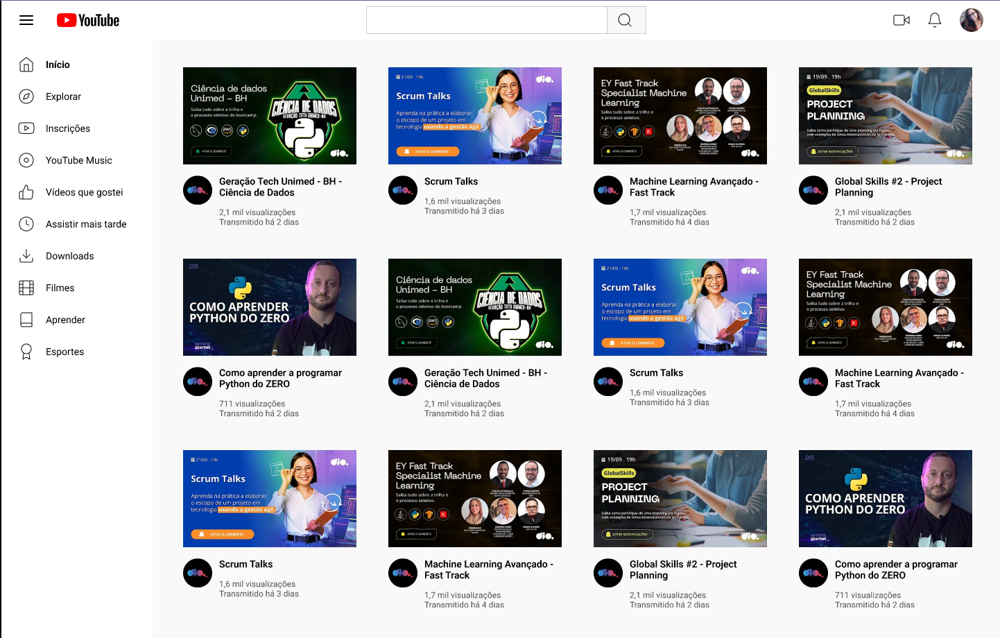

# Desafio : Criando pagina principal do Youtube utilizando Grid Layout.

Bem vindo(a) a pagina do youtube criada utilizando o grid layout para padronização dos componentes em tela.

[Link do Figma](https://www.figma.com/design/KknwioExyqKD3D2eSVFrcW/Desafio-Grid---DIO?node-id=1-2&t=VYnPS3Dk9jibHPrz-0) contendo o protótipo do desafio para
que você possa se basear.

